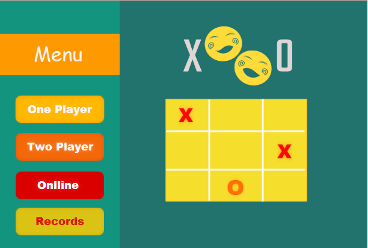

# Tic-Tac-Toe-Application

A network based Tic tac toe game,we have play single mode as playing aginest computer ,two player and multi player online. this implementation was done as the java project @ ITI intake 43 by students of the mobile native track.

## Installation
We have two javafx projects with names TicTacToeGame , GameServer to use them you have to write these command

```bash
git clone https://github.com/AhmedWard-eng/Tic-Tac-Toe-Application.git
```
 Then you can open client and server projects using editor like netbeans.
 
 you have to add jar files to projects to be able to run project ,you have to add gson jar lib ,download jdbc jar and jfoenix jar.

## Usage
first we have to run the GameServer application to play online
it will display it with start, stop buttons to open the server or close it.

then we will register to our game and log in to move list of onlie user who you can play with.

we can choose one player with computer ,two player ,online and if you want to record game in home page.


